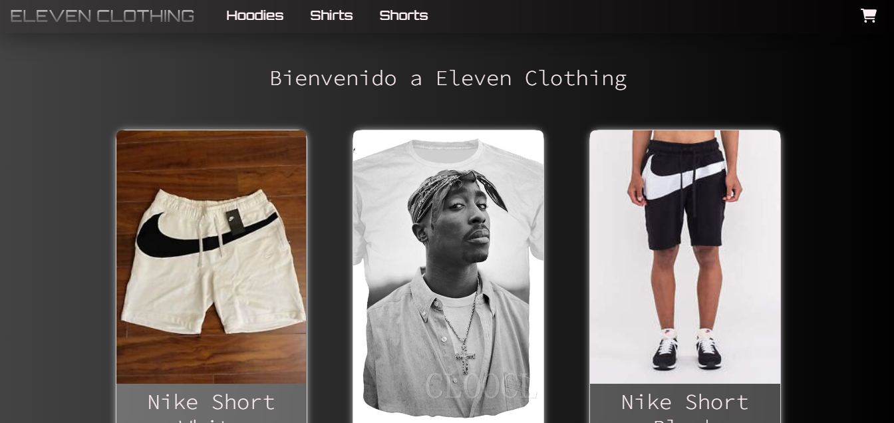

# E-commerce de tienda de ropa



Este proyecto se basa principalmente en la experiencia de completar una compra a través de internet. Se podrá mirar los productos disponibles, filtrarlos opcionalmente, agregarlos al carrito y finalizar la compra con los datos del comprador y su respectivo codigo de envío.

## Librerias utiizadas

- [Firebase](https://firebase.google.com/)
    ( Utilizada para almacenar los datos sobre los productos disponibles de la tienda, y a través de estos poder renderizarlos en el DOM.)
- [React Spinners](https://www.npmjs.com/package/react-spinners) (Esta libreria incluye varios modelos de loaders para mejorar la experiencia de usuario, y que este pueda ver que su acción está siendo ejecutada)
- [React-Router-DOM](https://reactrouter.com/en/main) (A través de esta libreria, se logra un dinamismo dentro de la página para poder navegar de manera rápida, y sin tener que aguardar a los tiempos de carga y actualización del sitio.)
- [React Bootstrap](https://react-bootstrap.github.io/) (Esta libreria influye principalmente en la estética del sitio, brindando diferentes estilos de componentes completamente personalizables y simples de utilizar)

## Funcionalidades del proyecto

- El usuario puede visualizar los productos en el home rápidamente, con su respectiva descripción.

- En la barra de navegación, dispone de las categorías en las que los productos se dividen, para poder filtrar según su interés.

- En caso de que esté interesado, dispone de un botón para poder acceder al detalle del producto.

- A través de un contador, el usuario puede seleccionar la cantidad de cada producto, y añadirlo al carrito.

- Una vez que quiera finalizar su compra, podrá acceder al carrito de compras desde el mismo detalle del producto, o bien a través del icono ubicado en la barra de navegación.

- Dentro del carrito podrá eliminar el producto seleccionado, en caso de un error, o limpiar directamente todos los productos.

- Si es que accedió al carrito por error, tendrá un botón para poder volver al home y continuar con su compra rápidamente.

- Si decide seguir con la compra, podrá acceder al checkout, donde deberá completar los campos con sus datos para poder recibir un ID único correspondiente a su pedido.


### Pasos para correr el proyecto de manera local

1. Clonar el repositorio a través del link

```
git clone https://github.com/Asant11/ElevenClothingReact.git
```

2. A través de un editor de código, abrir el proyecto e instalar las dependencias correspondientes mediante la consola.

```
npm install
```
3. Correr el proyecto

```
npm start
```

### Ver proyecto online

    Para ver el proyecto funcionando, colocar el siguiente link en el navegador:

```
eleven-clothing-santisi.netlify.app
```
---


